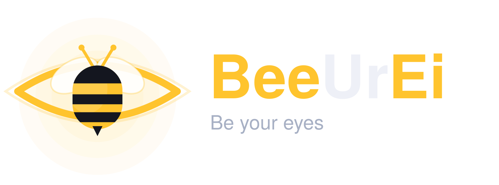
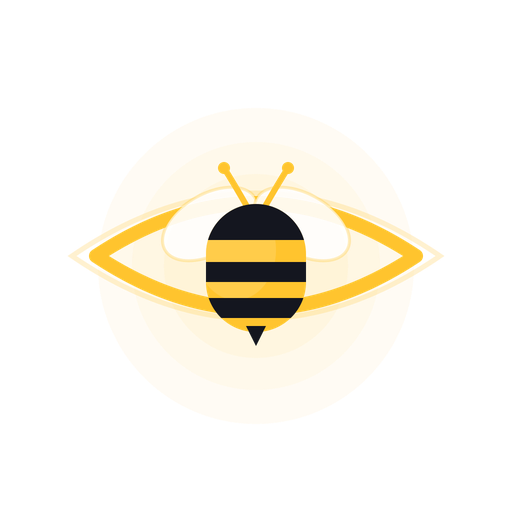

<p align="center">
  <picture>
    <source media="(prefers-color-scheme: dark)" srcset="BeeUrEi-Brand-Assets/03-wordmark/beeurei-wordmark-horizontal-light-1720.png">
    
  </picture>
</p>

<p align="center">
  <b>Be Your Eye · 用 iPhone 的摄像头与 LiDAR，做视障者的另一双眼睛</b><br/>
  <sub>On-device real-time obstacle avoidance · walking navigation · live human assistance — for the blind & low-vision.</sub>
</p>

<p align="center">
  
  
  
  
  
  
  
</p>

---

## 这是什么

**BeeUrEi**（Be Your Eye）是一款原生 iOS App：用 iPhone 主摄像头 + LiDAR，为视力障碍人士提供

- 🛡️ **实时避障** —— 端侧 AI 连续判断前方障碍，用语音 + 空间音 + 震动提示「是什么、几点钟方向、还有多远」；
- 🧭 **步行路线导航** —— 空间音「信标」+ 转向播报，安全门控（低定位精度绝不下达「现在过马路」）；
- 🤝 **远程真人协助** —— 端侧能力不足时一键呼叫亲友/志愿者视频帮忙（视障侧画面默认不外发，刻意操作才显示，保护隐私）。

> 名字寓意：一只蜜蜂正是眼睛的瞳孔，替你「看」路；外圈微光象征 LiDAR 扫描与蜂鸣提示。

### 安全红线（务必知悉）

> **BeeUrEi 是「感知增强的辅助工具」，不是「安全保障设备」。它不能替代白手杖、导盲犬或定向行走（O&M）训练，也不保证检测出所有障碍。请始终保留并优先使用它们，切勿将本 App 作为出行的唯一依据。**

---

## ✨ 设计原则

| 原则 | 含义 |
|---|---|
| **端侧优先** | 所有视觉 AI 推理在 iPhone 本机完成；画面默认不上云做推理——低延迟、可离线、隐私好 |
| **安全攸关** | 把避障/导航的物理与定位局限当一等公民：分级降级、保守门控、反复且不扰民地免责告知 |
| **无障碍即全部** | 100% VoiceOver 可用；语音/空间音/震动多模态、互不打断；为低视力设计高对比 |
| **端口–适配器** | 安全逻辑下沉为平台无关、可单测的核心；I/O（相机/ARKit/语音/网络）是可替换的适配层 |
| **自托管** | 后端与 WebRTC 信令/TURN 可完全自托管，规避第三方按量 RTC 费用 |

---

## 🏗 架构

```
┌──────────────────────────── iPhone（原生 Swift / SwiftUI）────────────────────────────┐
│                                                                                       │
│  Capture(ARKit+LiDAR) ─▶ FrameSource 端口 ─▶ Perception(Core ML/Vision，端侧推理)      │
│        │                  （未来可换外接眼镜/耳机）          │                          │
│        ▼                                                    ▼                          │
│  ARSession 深度/画面                          障碍{类别·几点钟·米数} ─▶ 稳定化(迟滞)     │
│                                                             │                          │
│                                          Feedback 仲裁(优先级抢占) ─▶ 语音/空间音/震动  │
│                                                                                       │
│  ── 核心安全逻辑（平台无关 Swift Package，149 单测）──────────────────────────────────  │
│  ClockDirection · DepthSampler · ObstacleRanker · FeedbackArbiter · LatencyBudget      │
│  LocationAccuracyGate · HeadingFilter · ThermalPolicy/PowerPolicy · RouteProgress ...  │
└───────────────────────────────────────────────────────────────────────────────────────┘
            │ REST + WebSocket 信令（仅网络通信，不做 AI 推理）           ▲
            ▼                                                            │ P2P 媒体(WebRTC)
┌──────────────── 自托管后端（Node + TypeScript + Fastify）─────────┐    │  直连失败时经
│ 账号/角色(JWT/RBAC) · 亲友绑定 · 紧急呼叫路由 · WebRTC 信令(/ws)   │    │  ┌─────────────┐
│ 管理员/举报 · 录制配置+留存 · 开发者端点 · SQLite 持久化           │◀───┘  │ coturn TURN │
└───────────────────────────────────────────────────────────────────┘       └─────────────┘
```

---

## 🧩 技术栈

| 层 | 选型 |
|---|---|
| 端侧感知 | ARKit `sceneDepth`（LiDAR 测距）· Core ML / Vision（YOLO 目标检测）|
| 反馈 | AVSpeechSynthesizer（TTS）· AVAudioEngine 空间音 · Core Haptics · 与 VoiceOver 协作 |
| 导航 | MapKit 步行路线（海外）· 持牌图商 SDK（中国大陆，规划中）· CoreLocation |
| 远程协助 | WebRTC P2P · 自托管 WebSocket 信令 · 自托管 coturn TURN |
| 界面 | SwiftUI（iOS 17+，`@Observable` MVVM）|
| 后端 | Node.js + TypeScript + Fastify + `node:sqlite` + JWT/bcrypt + WebSocket |
| 工程 | XcodeGen · Swift Package（核心逻辑）· Vitest（后端）|

---

## 📂 项目结构

```
Project_BeeUrEi/
├─ BeeUrEi/                  iOS App（适配层 + 界面）
│  ├─ Sensors/ Capture/      FrameSource 端口、ARKit 采集、深度采样
│  ├─ Perception/            YOLO 检测器（Core ML/Vision，ROI 聚焦）
│  ├─ Feedback/              语音/空间音/震动 + 仲裁 + AirPods 头追踪
│  ├─ Navigation/            MapKit 步行导航
│  ├─ RemoteAssist/          信令客户端、媒体引擎抽象、亲友名单
│  ├─ Account/               登录、Keychain、API 客户端
│  └─ Features/              首屏、设置、通话、登录、导航、引导
├─ Packages/BeeUrEiCore/     平台无关核心安全逻辑（+ 单元测试）
├─ server/                   自托管后端（Node + TS）
├─ docs/                     PLAN.md（总设计）· BACKEND_PLAN.md（后端蓝本）· RESEARCH_NOTES.md
└─ BeeUrEi-Brand-Assets/     品牌资产（图标 / 字标 / 配色）
```

---

## 🚀 快速开始

### App（需带 LiDAR 的 iPhone：12 Pro 及更新 Pro 机型）

```sh
open BeeUrEi.xcodeproj        # 工程由 XcodeGen 生成；改 project.yml 后 `xcodegen generate`
```
在 Xcode 选中 target → **Signing & Capabilities** 选你的 Apple ID → 接真机 → `⌘R`。
（相机/LiDAR 必须真机；模拟器会显示「设备不支持」。详细新手步骤见 [docs/PLAN.md](docs/PLAN.md) §9。）

### 后端（自托管，开箱即跑）

```sh
cd server
npm install
ADMIN_USERNAME=root ADMIN_PASSWORD=你的强密码 npm run dev   # http://localhost:8787
curl http://localhost:8787/health        # → {"status":"ok",...}
```

---

## 🧪 测试与质量

```sh
swift test --package-path Packages/BeeUrEiCore   # 核心安全逻辑：120 测试
cd server && npm test                            # 后端：29 测试
```

- **149 个单元测试全部通过**；后端 `tsc` 类型检查干净、App 编译通过。
- 核心安全逻辑经过一轮**多智能体对抗式代码审查**，已修复 10 个真实缺陷（含非有限输入崩溃、安全门控边界等）并补齐回归测试。
- 安全攸关的数学/门控（几点钟方向、深度分级、定位精度、延迟预算、转向播报…）全部下沉到核心包并单测——无需模拟器即可在本机验证。

---

## ♿ 无障碍与安全

- 全程 **VoiceOver** 可用；语音播报在 VoiceOver 开启时自动改用无障碍播报，避免抢话。
- **多模态、防过载**：避障可打断导航；同一目标说完不被反复打断（时间稳定化 + 仅变化时播报）。
- **分级降级**：LiDAR 跟踪不稳、设备过热、低电量、定位精度差时主动降级并告知；过热安全停机。
- **免责告知**：首次/定期完整知情同意 + 每次开始一句可关的简短提醒。
- 上线前需**真实视障用户**参与测试，并与定向行走（O&M）专家共定安全策略。

---

## 🔐 隐私

- 视觉 AI **全部端侧**，画面默认不上云做推理。
- 远程视频走 **P2P**；视障侧摄像头默认只传音频、**不输出画面**，仅在刻意操作时临时显示，保护隐私。
- 通话**默认不录制**；如启用需双方知情同意，媒体加密存储、到期自动删除。
- 权限文案最小化，附 Privacy Manifest（开发中）。

---

## 🗺 状态与路线图

| 阶段 | 内容 | 状态 |
|---|---|---|
| 核心安全逻辑 | 26 模块 / 149 测试 / 对抗式审查 | ✅ |
| Phase 1 实时避障 | ARKit 深度 + YOLO 检测 + 中文播报 + 稳定化 | ✅（待真机调参）|
| Phase 2 步行导航 | 海外 MapKit 接线 | ✅（待真机定位）· 国内图商需 API key ⏳ |
| 自托管后端 | 账号/亲友/紧急/信令/管理/录制/开发者 | ✅ |
| Phase 3 远程视频 | 信令 + UI + 隐私门控就位 | ✅ · 真实 WebRTC 媒体引擎需 SPM 包 + 双真机 ⏳ |
| Phase 4 打磨上架 | 真机实测 / 真实用户测试 / 上架 | ⏳ 外部资源 |

详见 **[docs/PLAN.md](docs/PLAN.md)**（11+ 章总设计与决策）与 **[docs/BACKEND_PLAN.md](docs/BACKEND_PLAN.md)**。

---

## 📚 文档

- [docs/PLAN.md](docs/PLAN.md) — 完整项目计划、架构、风险、分阶段路线图、工程任务勾选
- [docs/BACKEND_PLAN.md](docs/BACKEND_PLAN.md) — 后端 API / 数据模型 / 信令协议 / 视频隐私门控
- [docs/RESEARCH_NOTES.md](docs/RESEARCH_NOTES.md) — 竞品与技术调研（含事实核查）
- [server/README.md](server/README.md) — 后端运行与端点

---

## 🎨 品牌

蜂蜜黄 `#FFC42E` · 墨蓝 `#14161F`。完整图标 / 字标 / 配色见 [`BeeUrEi-Brand-Assets/`](BeeUrEi-Brand-Assets/)。

<p align="center">
  
</p>

---

## 🏢 组织与作者

- **隶属组织**：Hiko Sphere 彦穹科技
- **软件制作人**：Li Yanpei Hiko

## 📄 许可证

待定（TBD）。这是一个以无障碍公益为初心的项目——欢迎以「辅助而非替代」为前提共建。

<p align="center">
  <sub>BeeUrEi — Be Your Eye 🐝 ｜ © 2026 Hiko Sphere 彦穹科技 · Li Yanpei Hiko</sub>
</p>
