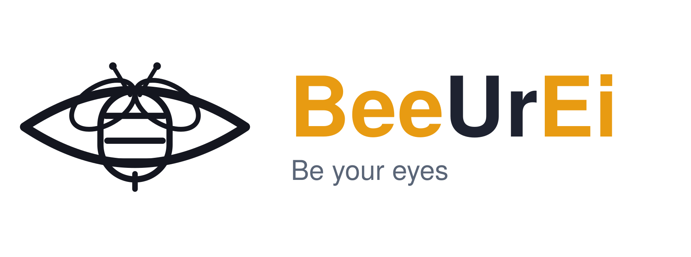
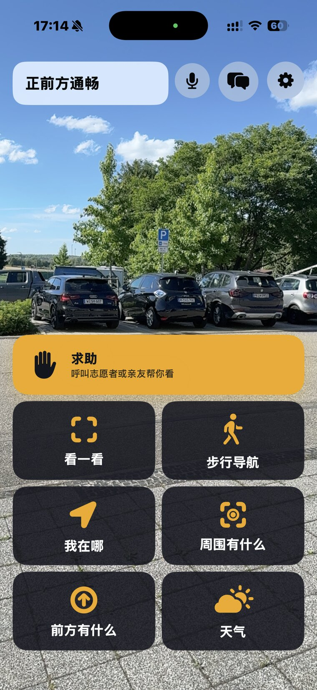
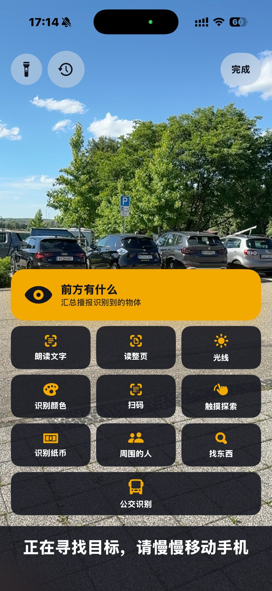
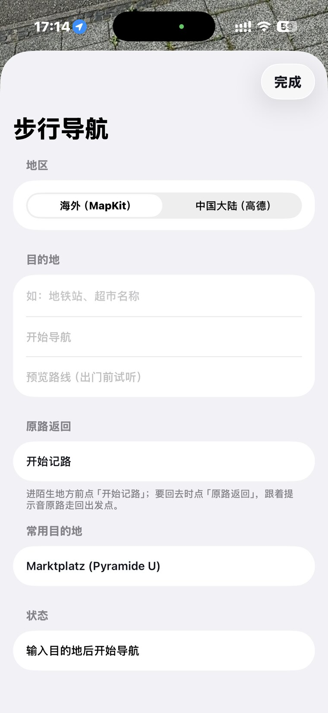
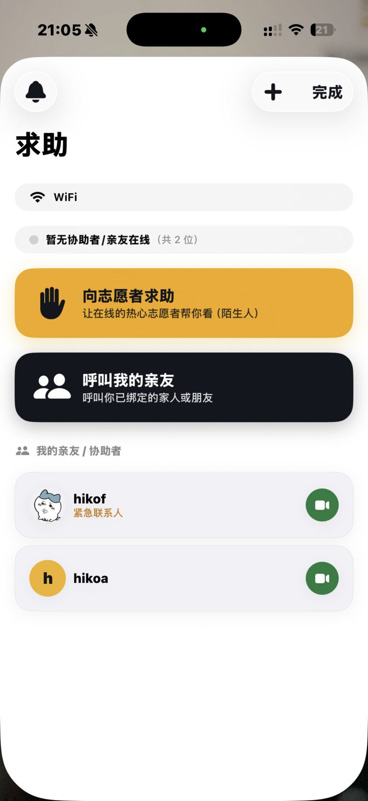
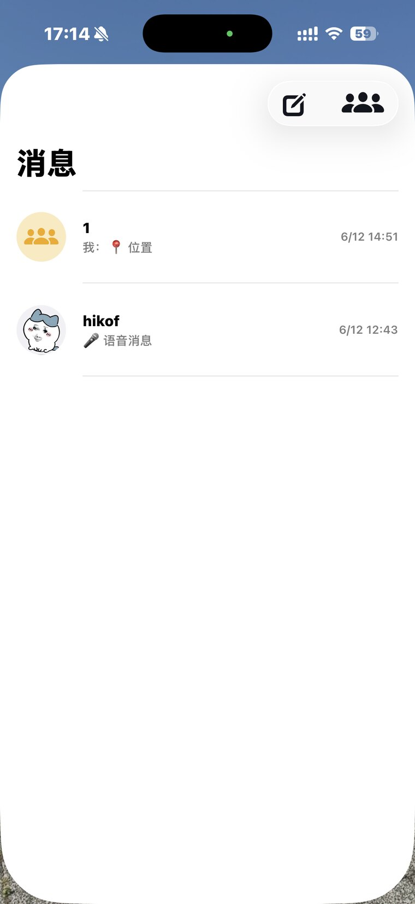
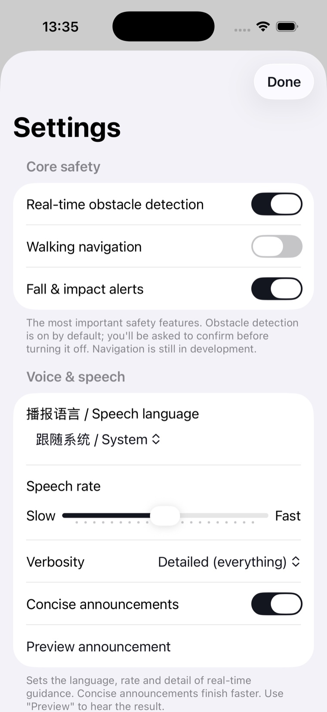
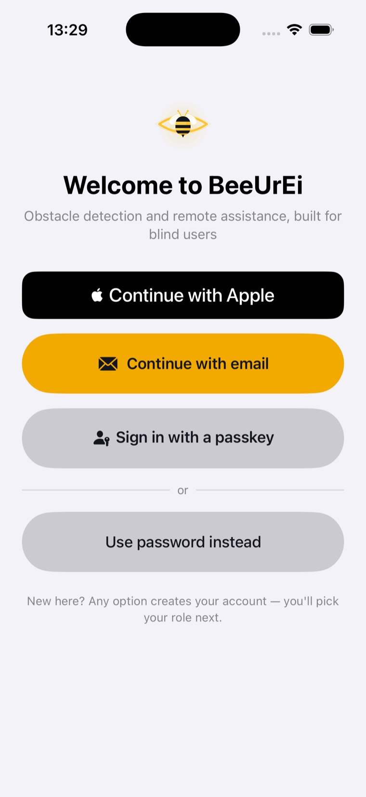
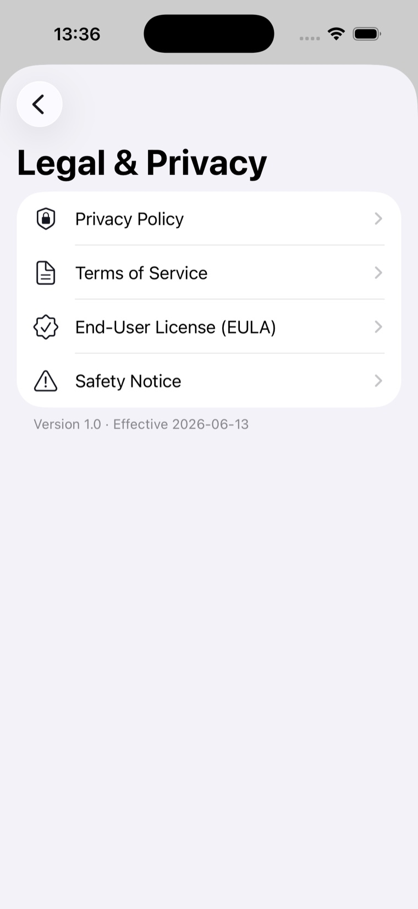
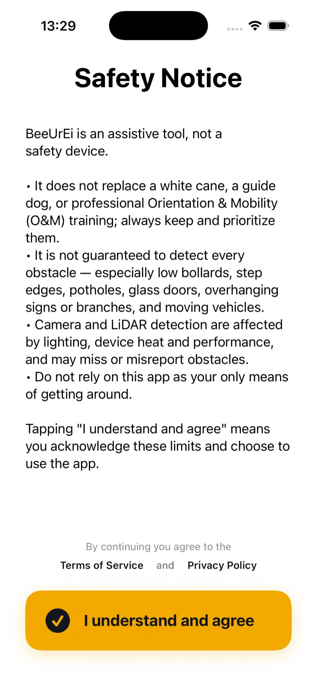

<!-- 维护者备注：将仓库 About 设为下方 tagline，Website 设为 https://beeurei.hikosphere.com，topics 设为：accessibility, ios, blind, low-vision, lidar, webrtc, on-device-ai, swift, voiceover。 -->
<div align="center">

<picture>
  <source media="(prefers-color-scheme: dark)" srcset="BeeUrEi-Brand-Assets/03-wordmark/beeurei-wordmark-horizontal-dark-1720.png">
  <source media="(prefers-color-scheme: light)" srcset="BeeUrEi-Brand-Assets/03-wordmark/beeurei-wordmark-horizontal-light-1720.png">
  
</picture>

### 为视障与低视力人士打造的「第二双眼睛」——就在你的 iPhone 上。

**端侧实时避障 · 步行导航 · 场景与物体识别 · 真人远程协助。**
视觉 AI 全部在设备本地运行，画面默认不离开手机。

**[English](README.md) · 简体中文**

[](https://github.com/Hiko-Sphere/BeeUrEi/actions/workflows/ci.yml)


[官网](https://beeurei.hikosphere.com) · [法律与隐私](https://beeurei.hikosphere.com/legal/) · [品牌资产](BeeUrEi-Brand-Assets/)

</div>

> **BeeUrEi**（Be Your Eye / 蜂之眼）把 iPhone 的主摄与 LiDAR 变成「第二双眼睛」。蜜蜂即眼睛的瞳孔，替你「看」路；周围的微光，是 LiDAR 扫描与蜂群引导的嗡鸣。免费、隐私优先、可自托管。由 **Hiko Sphere 彦穹科技** 制作，制作人 **Li Yanpei Hiko**。

---

> [!IMPORTANT]
> **BeeUrEi 是「感知增强的*辅助工具*」，不是安全设备。** 它**不能**替代白手杖、导盲犬或定向行走（O&M）训练，也**无法**检测每一个障碍。请始终保留并优先使用它们，切勿把本 App 作为出行的唯一依据。

---

## 目录

- [BeeUrEi 能做什么](#beeurei-能做什么)
- [为什么选 BeeUrEi（对比同类）](#为什么选-beeurei)
- [设计原则](#设计原则)
- [架构](#架构)
- [技术栈](#技术栈)
- [仓库结构](#仓库结构)
- [截图](#截图)
- [上手](#上手)
- [测试与质量](#测试与质量)
- [无障碍与安全](#无障碍与安全)
- [隐私](#隐私)
- [文档与链接](#文档与链接)
- [状态与路线图](#状态与路线图)
- [常见问题](#常见问题)
- [安全披露](#安全披露)
- [参与贡献](#参与贡献)
- [品牌、作者与许可](#品牌作者与许可)

---

## BeeUrEi 能做什么

四大核心能力，全部围绕视障与低视力的使用场景设计。视觉 AI 在**设备本地**运行，画面默认不离开手机。

#### 1. 端侧实时避障
本地 AI 持续判读前方，播报**「是什么 · 钟面方向 · 多远」**，并通过三通道同时反馈：**语音 + AirPods 双耳空间音 + 触觉**。含**下沉 / 台阶边缘检测**、**过街三通道信号**（节奏音 + 节奏振动 + 全屏高对比颜色），以及**接近声呐**。

#### 2. 步行导航
空间音**信标**为你指向，配合转向语音与**路名**播报。**「原路返回」**记录你走过的路并引导你回到出发点。三个**「感知周围」**动作——*我在哪 / 周围有什么 / 前方有什么*——均带钟面方位与距离。

#### 3. 场景与物体识别（「看一看」）
朗读文字 · 读整页多页文档 · 识别**纸币** · 扫码并记住商品 · 教一次后**找你自己的东西** · 找附近常见物 · **周围的人**（数量 · 方向 · 距离，**绝不**识别身份） · 公交线路 · 光线强弱 · **触摸探索**定格照片 · 回看识别历史。全部端侧，画面不离开手机。

#### 4. 真人远程协助
一键视频呼叫**亲友或志愿者**。盲人侧**摄像头默认关闭**、仅按需共享；来电带**声音 + 振动 + 语音报名**。通话中，明眼协助者可远程开**手电**、变**焦**看清。通话**仅在双方同意时**才会录制（服务端核验），你可**回看或删除**自己的录制——每条都记录时间、参与者、时长与地点。

#### 信任、安全与治理
面向脆弱用户，安全本身就是功能。内置**举报**（可附录制作为证据）、**拉黑**与处置阶梯；举报结果经持久化的**站内收件箱通知双方**。为防滥用，管理员可**旁观进行中的通话**（开麦说话或强制结束）——但**绝非隐蔽：双方都会被实时告知**（不可关闭的横幅 + 语音播报），且无法显示该告知的旧版客户端不会被旁观。每一次特权操作都**入审计**。

---

## 为什么选 BeeUrEi

<a id="为什么选-beeurei"></a>
大多数无障碍 App 只把其中**一件事**做好。BeeUrEi 把避障、导航、识别与真人协助合到一起——默认端侧，且可自托管。

| 能力 | **BeeUrEi** | Seeing AI | Lookout | Be My Eyes | Soundscape 类 |
|---|:---:|:---:|:---:|:---:|:---:|
| 避障（LiDAR 测距 + 下沉检测） | ✅ | ❌ | ❌ | ❌ | ❌ |
| 步行导航 + 空间音信标 + 原路返回 | ✅ | ❌ | ❌ | ❌ | 仅信标 |
| 完整识别套件（文字 / 纸币 / 商品 / 找物 / 人 / 公交 / 光线） | ✅ | ✅ | ✅ | 部分 | ❌ |
| 真人视频协助 | ✅（亲友 + 志愿者） | ❌ | ❌ | ✅ | ❌ |
| 避障 + 导航 + 识别三合一 | ✅ | ❌ | ❌ | ❌ | ❌ |
| 画面不离设备（识别全端侧） | ✅ | 部分上云 | 部分上云 | 部分上云 | ❌ |
| 自托管后端 | ✅ | ❌ | ❌ | ❌ | ❌ |
| 端到端中英双语 | ✅ | — | — | — | — |
| 源码可得（非商用） | ✅ | ❌ | ❌ | ❌ | ❌ |

*此表反映 BeeUrEi 的设计目标与对其他 App 的公开定位理解，并非准确率基准测评。*

---

## 设计原则

- **端侧优先** —— 视觉 AI 本地运行，画面默认不离开手机。
- **安全攸关** —— 分级降级、保守门控。GPS 差时*绝不*说「现在过街」；不确定时说「可能是 X」而非乱猜。
- **一次只一个声音** —— 全局语音总线仲裁优先级：**避障 > 来电 > 导航 > 识别**，绝不重叠；被警告打断的导航指令会在其后**重播**。
- **无障碍即全部** —— 100% VoiceOver 可用，**Magic Tap** 直达每屏最重要动作，多模态语音 / 空间音 / 触觉，高对比大字。
- **端口与适配器** —— 安全逻辑放在平台无关、可单测的 Swift Package；所有 I/O 协议驱动、可注入。
- **可自托管** —— 后端 + WebRTC 信令 + TURN 全部可自托管，**零第三方按次费用**。

---

## 架构

视觉流水线全部在 iPhone 上运行。后端**只负责网络**（账号、通话路由、信令），**不做任何 AI 推理**。

为避免 GitHub 等宽字体下中文双宽字符撑破方框右边线，下图在含中文的行只保留左侧竖线，注释置于箭头之上。

```
iPhone（Swift / SwiftUI）
│
│  ARKit + LiDAR
│      ──▶  FrameSource 端口
│      ──▶  端侧 Core ML / Vision 感知
│              ──▶  障碍 { 标签 · 钟面 · 米 }
│              ──▶  稳定化
│              ──▶  FeedbackArbiter（优先级仲裁）
│                      ├──▶  语音
│                      ├──▶  双耳空间音
│                      └──▶  触觉
│
│  SpeechHub（统一语音总线）：来电 > 导航 > 识别  ──全部让位──▶  避障
│
│  REST + WebSocket 信令（仅网络——无 AI 推理）
▼
自托管后端（Node + TypeScript + Fastify）
│
│  账号与角色（JWT / RBAC） · 亲友绑定（双向同意） · 通话路由
│  求助队列 · 推送 + 站内收件箱 · 录制（同意 · 合规留存 · 回看）
│  管理员旁观网格（告知双方） · 举报+证据 · 内容治理 · SQLite
▼
WebRTC P2P 媒体  ──▶  直连失败时，经自托管 coturn（TURN）中继转发
```

**平台无关的安全核心**（Swift Package，**319** 单测）：`ClockDirection`、`DepthSampler`、`ObstacleRanker`、`FeedbackArbiter`、`SpeechGate`、`LocationAccuracyGate`、`WaypointAdvance`、`CurrencyClassifier`、`BusDisplayReader` 等。

---

## 技术栈

**端侧感知** —— ARKit `sceneDepth`（LiDAR 测距）、Core ML / Vision（目标检测 · OCR · 条码 · 人脸框 · FeaturePrint）。
**反馈** —— `AVSpeechSynthesizer`（总线仲裁）、`AVAudioEngine` 双耳 HRTF 空间音、Core Haptics、VoiceOver 感知。
**导航** —— MapKit 步行路线（海外）、持牌图商 SDK（中国大陆，*规划中*）、CoreLocation、CLGeocoder 路名。
**远程协助** —— WebRTC P2P、自托管 WebSocket 信令、自托管 coturn、CallKit + PushKit（后台来电）。
**UI** —— SwiftUI（iOS 17+，`@Observable` MVVM）、AppIntents（**9** 个双语 Siri 快捷指令）。
**后端** —— Node.js + TypeScript + Fastify + `node:sqlite` + JWT + WebSocket。
**工具** —— XcodeGen、Swift Package、Vitest、GitHub Actions CI。

---

## 仓库结构

```
BeeUrEi/
├── BeeUrEi/                  iOS 适配层 + UI
│   ├── Sensors/ · Capture/   ARKit + LiDAR 采集
│   ├── Perception/           端侧 Core ML / Vision
│   ├── Feedback/             语音 · 空间音 · 触觉
│   ├── Navigation/           路线 · 信标 · 原路返回
│   ├── RemoteAssist/         WebRTC 通话 + 信令
│   ├── Account/ · Consent/    账号、角色、同意流程
│   └── Features/             场景与物体识别
├── Packages/BeeUrEiCore/     平台无关安全核心 —— 319 单测
├── Tests/BeeUrEiTests/       应用层回归 —— 72 测
├── server/                   自托管后端（Node + TS）—— 289 测 · 50 个测试文件
├── site/                     官网静态站 + /legal/ 法律页
├── BeeUrEi-Brand-Assets/     图标 · 字标 · 配色
└── .github/workflows/ci.yml  持续集成
```

---

## 截图

以下为真机实拍。

| | | |
|:---:|:---:|:---:|
|  |  |  |
| **主屏** —— 「正前方通畅」+ 求助 + 九宫格 | **看一看** —— 识别九宫格 | **导航** —— 步行路线 |
|  |  |  |
| **求助** —— 呼叫协助 | **消息** | **设置** |
|  |  |  |
| **登录** —— 登录方式 | **法律** —— App 内法律中心 | **安全** —— 安全须知 |

---

## 上手

### App

需要带 LiDAR 的 iPhone（12 Pro 或更新的 Pro）。相机与 LiDAR 需要**真机**——模拟器会提示 *device not supported*。

```bash
xcodegen generate        # 重新生成 Xcode 工程
open BeeUrEi.xcodeproj
```

在 Xcode 中：选中 target → **Signing & Capabilities** → 你的 Apple ID → 连接真机 → **⌘R**。

真实 WebRTC 媒体使用 vendored 的 `Frameworks/WebRTC.xcframework`（已 gitignore，约 91 MB）。有它则启用真实引擎；**没有也能编译，通话会如实失败**——不伪造连接。

### 后端（自托管，开箱即用）

```bash
cd server
npm install
ADMIN_USERNAME=root ADMIN_PASSWORD=你的强密码 npm run dev   # http://localhost:8787
curl http://localhost:8787/health    # → {"status":"ok",...}
```

**Docker** —— 先从模板创建 `server/.env`（`cp server/.env.example server/.env` 后填入真实值），再：

```bash
docker build -t beeurei-api server/
docker run --env-file server/.env beeurei-api        # 前置任意隧道
```

或不用 env 文件，直接内联传入变量：

```bash
docker run -e ADMIN_USERNAME=root -e ADMIN_PASSWORD=你的强密码 beeurei-api
```

生产环境的自托管后端运行在 **AWS（东京）+ Cloudflare Tunnel**，并配 **coturn** 做 TURN。

---

## 测试与质量

```bash
swift test --package-path Packages/BeeUrEiCore        # 核心安全逻辑 —— 319 测
xcodebuild test -scheme BeeUrEi                        # 应用层回归（模拟器）—— 74 测
cd server && npm test                                  # 后端 —— 289 测
```

**三套测试合计 682 项**（核心 319 + 应用层 74 + 后端 289）。GitHub Actions 每次推送都跑全量套件，后端 `tsc` 类型检查干净。上方的 **CI 徽章**是权威的通过 / 失败信号。

经多轮多智能体对抗式代码审查，修复 **160+ 真实缺陷**——信令窃听、录制媒体经错误端点可达、处置通知泄漏对方处罚、播放令牌在会话吊销后仍有效、障碍距离 / 方向错误、暗地面下沉误报、到达绕过精度门、磁干扰致信标误向、被打断后空间音永久静音、对盲人静默失败——每一项都配回归测试。安全攸关子系统各有专门回归网：**通话隐私门控、管理员旁观准入与中继、录制同意与回看授权、避障纪律、导航门控。**

---

## 无障碍与安全

- **100% VoiceOver 可用。** 开启 VoiceOver 时，语音走无障碍播报通道，绝不与之打架。每屏都有 **Magic Tap** 直达最重要动作。
- **一次只一个声音** —— 避障永远优先。
- **分级降级** —— LiDAR 不稳、设备过热、低电或定位差时，App 会播报降级状态；热保护会停止运行。
- **置信透明** —— 不确定时说「可能是 X」。
- **首启完整知情同意**（双语），并在每次会话提供可关闭的简短提醒。

> 任何公开发布前，BeeUrEi 都必须与**真实盲人用户**测试，并与**定向行走（O&M）专家**共同制定安全策略。

---

## 隐私

- 视觉 AI **全端侧**，画面默认不离开手机。
- **「周围的人」**只报数量与方向——**无身份、不存脸**。
- 实时视频为 **P2P**；盲人侧摄像头**默认关闭**、仅按需共享，且每当有新成员加入即**重置为关**。
- 识别历史、商品库与教学物品**仅存设备**（`completeFileProtection`）。
- 通话**默认不录**；录制须**双方知情同意**（服务端核验），到期后短期内（默认 7 天）自动删除，期间你可随时回看或删除。
- 为防滥用，管理员可**旁观进行中的通话——绝非隐蔽**：双方均被实时告知（横幅 + 语音），旁观通道与 1:1 媒体隔离；特权访问**入审计**。
- 自托管后端——账号与通话路由数据存在**你自己的服务器**上。
- **注册账号现须先阅读并同意《隐私政策》与《使用条款》方可完成。**

完整法律文本——隐私 / 条款 / EULA，中英双语——见官网 **<https://beeurei.hikosphere.com/legal/>** 与 App 内**「法律与隐私」**中心。

---

## 文档与链接

- **官网** —— <https://beeurei.hikosphere.com>
- **法律文件**（隐私 · 条款 · EULA，中英双语，v3.0）—— <https://beeurei.hikosphere.com/legal/>
- **技术交底**（完整架构与安全模型）—— [`docs/技术交底.md`](docs/技术交底.md)
- **品牌资产**（图标 · 字标 · 配色）—— [`BeeUrEi-Brand-Assets/`](BeeUrEi-Brand-Assets/)
- **安全策略** —— [`SECURITY.md`](SECURITY.md)
- **贡献指南** —— [`CONTRIBUTING.md`](CONTRIBUTING.md)
- **行为准则** —— [`CODE_OF_CONDUCT.md`](CODE_OF_CONDUCT.md)
- **管理后台** —— 自托管于 `/admin`

---

## 状态与路线图

| 模块 | 状态 |
|---|---|
| 核心安全逻辑 | ✅ 已完成 |
| 阶段 1 —— 实时避障 | ✅ 已完成（待真机调参） |
| 阶段 2 —— 步行导航（海外） | ✅ 已完成 |
| 步行导航 —— 大陆图商 | ⏳ 待 key |
| 识别套件 | ✅ 已完成（部分待真机验证） |
| 双语（EN · 中文） | ✅ 已完成（英文文案待母语校对） |
| 自托管后端 | ✅ 已完成——已部署 |
| 阶段 3 —— 实时视频 | ✅ 已完成（待双端验证） |
| 阶段 4 —— 打磨上架 | ⏳ 待外部资源 |

---

## 常见问题

**需要哪种 iPhone？**
实时避障依赖 LiDAR，需要带激光雷达的 iPhone（iPhone 12 Pro 或更新的 Pro 机型）。其余功能（识别、导航、消息、远程协助）在更多机型上也可使用。

**需要联网吗？**
避障与全部识别在本机离线运行；步行导航、真人远程协助、消息与紧急通知是联网功能。

**我的摄像头画面会被上传吗？**
默认不会。所有视觉 AI 在本机完成。只有当你主动向选定的人发起远程协助、并按住「显示画面」时，画面才会实时传输——而且是点对点。

**它能替代白手杖或导盲犬吗？**
不能。BeeUrEi 是感知增强的辅助工具，不是安全设备，无法检测出每一个障碍。请始终保留并优先使用白手杖、导盲犬与定向行走（O&M）训练。

**注册需要同意什么吗？**
需要——创建账号必须先阅读并同意《隐私政策》与《使用条款》；你的同意（版本 + 时间）会被记录，以便可证明。

**我可以自己部署后端吗？**
可以——后端、WebSocket 信令与 TURN 中继均可完全自托管，无第三方按次费用。见 [上手](#上手)。

**上架 App Store 了吗？**
还没有，正在准备中。核心已构建并测试，接下来是真机调参与盲人用户测试。

**为什么用非商业许可？**
BeeUrEi 是面向其服务的视障人士的公益项目。可免费用于非商业目的的使用、学习、修改与分享；不得出售（或向这些用户收费）。

---

## 安全披露

发现安全问题？请通过邮件**私下**报告至 **<beeurei@163.com>**——**请勿公开提交 issue。** 我们会确认你的报告，并在任何公开披露前与你一起修复。完整说明见 [`SECURITY.md`](SECURITY.md)。

---

## 参与贡献

欢迎非商业贡献。提交 Pull Request 前，请：

1. **跑通测试**，确保全绿（`swift test --package-path Packages/BeeUrEiCore`、`xcodebuild test -scheme BeeUrEi`，以及 `cd server && npm test`）。
2. **遵循现有风格与结构**——把安全逻辑放在 `Packages/BeeUrEiCore` 并配测试。
3. **在本项目许可下提交**——PolyForm Noncommercial 1.0.0。

凡涉及安全攸关子系统（避障、导航门控、通话隐私）的改动，请附带回归测试。完整指南见 [`CONTRIBUTING.md`](CONTRIBUTING.md)，社区约定见 [`CODE_OF_CONDUCT.md`](CODE_OF_CONDUCT.md)。

---

## 品牌、作者与许可

**配色** —— Honey `#FFC42E` · Ink `#14161F`。资产见 [`BeeUrEi-Brand-Assets/`](BeeUrEi-Brand-Assets/)（字标 `03-wordmark`，mark `02-mark`）。

**作者** —— Hiko Sphere 彦穹科技 / 制作人 Li Yanpei Hiko。

**许可** —— **PolyForm Noncommercial 1.0.0。** 你可出于任何**非商业**目的自由**使用、学习、修改与分发** BeeUrEi。**禁止商用**——包括出售，或向它本应服务的视障 / 低视力用户收费。本软件按**「现状」提供、不附带任何担保**，且是**辅助工具，不能替代**白手杖、导盲犬或 O&M 训练。详见 [`LICENSE`](LICENSE) 与 [`NOTICE`](NOTICE)。

© 2026 Hiko Sphere 彦穹科技 · Li Yanpei Hiko.

<div align="center">

*Be your eye. 蜂之眼，替你看路。*

</div>
